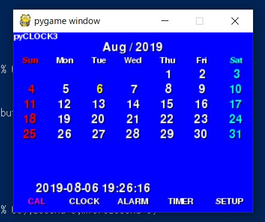
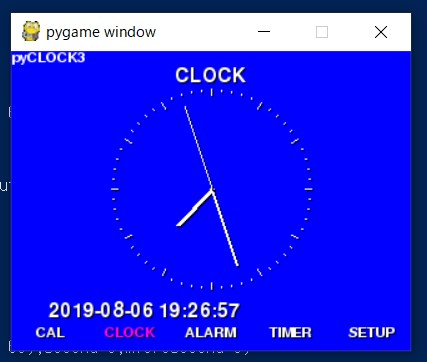

# pyCLOCK 

A clock application.

## Required
* Python
* Pygame

## Screenshots

## History 
* 1.1   Rewritten for Python3
* 1.01  hwclock problem is fixed , thanks mth.
* 1.0   First release

## License

The code is provided under the MIT License.  

Please see the below URL for the detail

http://opensource.org/licenses/mit-license.php

